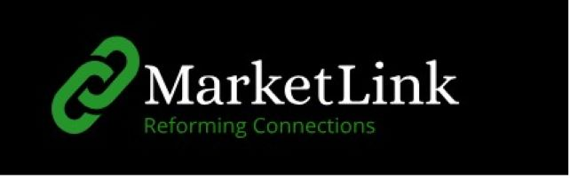

# Paidamoyo Mapfuwa ✨
**Developer and aspiring data scientist**

 

   <ul>
   <li><a href="#intro">Who is Paidamoyo Mapfuwa</a>  </li>
   <li><a href="#skills">Languages and Technologies</a>   </li>
   <li><a href="#projects">Projects</a>   </li>
   </ul>  
 
 
 

 <h2>Who is Paidamoyo</h2>
I am an upcoming software engineer and aspiring data scientist. My passion for IT was ignited by my father's vast knowledge of computers, which he passed down to me, 
 inspiring a desire to learn more about the field. I majored in Computer Science and Informatics in college and gained valuable experience throughout my studies, from creating a
 "Hello World" program in Visual Basic to developing complete management systems, among many other projects I have had the privilege to be a part of. I possess a solid skill 
 set in languages such as Java, C++, C#, JavaScript, Python, SQL, and various frameworks.
 

 

 <h2 id="skills">Languages and Technologies</h2>
 
          
 
 
 
 
 
 
 
 
 
 
    
  
 

  
 

  <h2 id="projects">Projects</h2>
  <h3>E-commerce website (Marketlink)</h3>
  

     As part of my Informatics 2 course focused on e-commerce websites, I worked in a group of four to develop a three-tier e-commerce platform.
     Our team created a B2B website for scrap and recyclable materials. We utilized ASP.NET, C#, and SQL for the project. This experience required significant
     commitment, a willingness to learn, and dedication from all team members. Among the key lessons I learned were the importance of teamwork and effective communication, 
     and I had the opportunity to enhance my problem-solving skills in a real-world scenario.  
    <a href="https://github.com/Precious0825M/KPPTWebChronicles2">Repo</a>  
    <i>NB: Markelink logo os a link to the project demo video</i>
   
  

    

  <h3>Athlete Management and Booking Sysytem</h3>
  

   <b>Background and Problem</b> 
    UJ Sport plays a crucial role in promoting fitness, developing talent, and fostering teamwork within the university community. Despite its commitment to athletic 
    excellence, UJ Sport's reliance on manual systems like Excel, WhatsApp, and word-of-mouth for athlete management, communication, and bookings has created inefficiencies. 
    Key challenges include a lack of integration, inconsistent communication, and time-consuming booking processes, resulting in data inaccuracies and operational delays. 
    These limitations hinder collaboration among athletes, coaches, and managers, affecting performance and satisfaction. Implementing a centralized athlete and 
    booking management system could streamline operations, enhance communication, and improve overall efficiency.  

   <b>Solution<b/> 
   To solve these issues, we propose creating the UJ Sport Athlete and Booking Management System. This system will centralize athlete management and daily operations with key features like: 
   <ul>
    <li> Athlete Profiles – Store athlete details, medical history, and performance records.</li>
     <li>Scheduling and Calendar – Easily manage training, competitions, and appointments with calendar integration and notifications.</li>
     <li>Performance Tracking – Monitor athlete progress and training performance.</li>
     <li>Coaching Tools – Provide feedback, training plans, and video analysis for skill improvement.</li>
     <li>Team Management – Organize teams, schedules, and group activities.</li>
     <li>Reports and Analytics – Generate reports on athlete performance and team data for better planning.</li>
   </ul>   
  

# Project Repositories  

<button style="background-color: #ff6347; color: white; padding: 12px 20px; border: none; border-radius: 8px; cursor: pointer; font-weight: bold; text-align: center; margin-bottom: 10px;">
  <a href="https://github.com/Paila-bot/UJ-Sport/tree/main" style="color: white; text-decoration: none;">📄 Docs Repo</a>
</button> 

<button style="background-color: #1e90ff; color: white; padding: 12px 20px; border: none; border-radius: 8px; cursor: pointer; font-weight: bold; text-align: center; margin-bottom: 10px;">
  <a href="https://github.com/IFMTYP2024/team26-mobile" style="color: white; text-decoration: none;">📱 Mobile Repo</a>
</button>  

<button style="background-color: #32cd32; color: white; padding: 12px 20px; border: none; border-radius: 8px; cursor: pointer; font-weight: bold; text-align: center;">
  <a href="https://github.com/IFMTYP2024/team26-main" style="color: white; text-decoration: none;">🌐 Web App Repo</a>
</button>   
<i>Picture is a link to the project demo</i>
   

 
 

